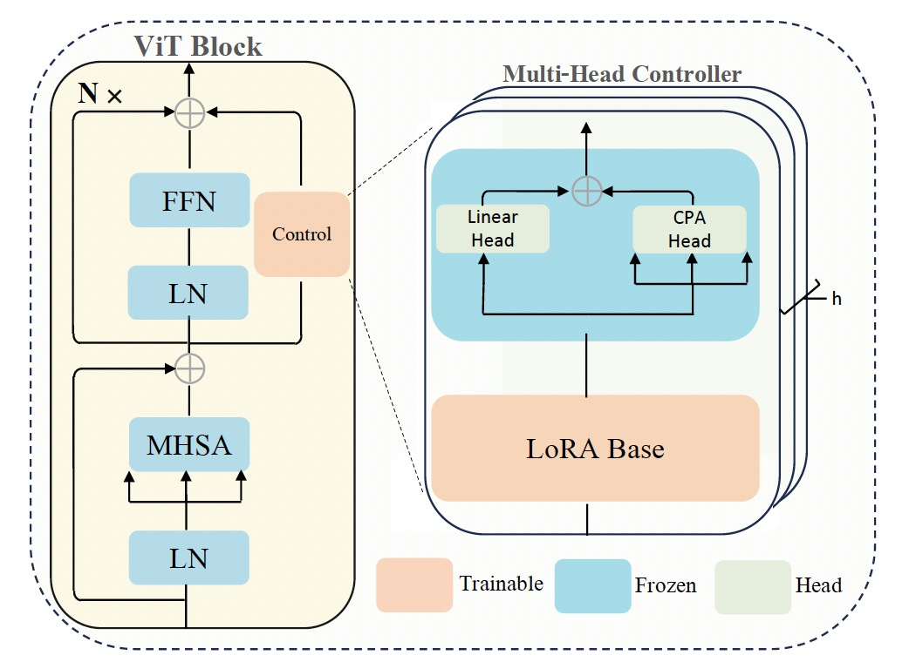

<div align="center">

## [ICML 2024] Parameter-Efficient Fine-Tuning with Controls

### [Paper](https://openreview.net/pdf?id=C4nalr0DoE) |  [Blog](https://medium.com/@czhang024/the-mechanism-behind-lora-a-control-view-f2079bba74b8)

<!--  -->


</div>


This is a PyTorch implementation of the paper [Parameter-Efficient Fine-Tuning with Controls](https://openreview.net/pdf?id=C4nalr0DoE). The goal of our work is to provide a pure control view for the well-known LoRA algorithm.


### Usage

#### Install
* CUDA 11.2 + PyTorch 2.1.0 + torchvision 0.16.0
* timm 1.0.7
* easydict

####  Download Pretrained Model
The mae_pretrain_vit_b model is available [here](https://github.com/ShoufaChen/AdaptFormer/blob/main/PRETRAIN.md).

#### Training
Start

```bash
python main.py  --batch_size 128 --cls_token  --drop_path 0.0 --lr_decay 0.97 \
   --dataset cifar100 --ffn_adapt
```

### Acknowledgement

The project is based on [MAE](https://github.com/facebookresearch/mae) and [AdaptFormer](https://github.com/ShoufaChen/AdaptFormer).
Thank all the authors for their awesome works.

### Citation
```
@inproceedings{zhangparameter,
  title={Parameter-Efficient Fine-Tuning with Controls},
  author={Zhang, Chi and Jingpu, Cheng and Xu, Yanyu and Li, Qianxiao},
  booktitle={Forty-first International Conference on Machine Learning}
}
```

### License

This project is under the MIT license. See [LICENSE](LICENSE) for details.
